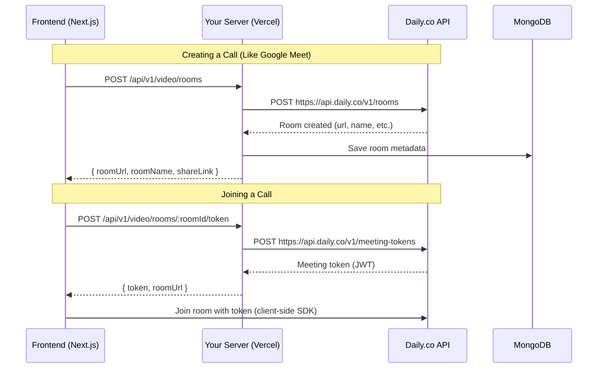

# Daily.co Video Call Backend Integration

This document outlines the backend implementation for video calling in HeartSpeak AI using Daily.co's REST API.

---

## Architecture Overview



---

## API Endpoints Summary

| Method | Endpoint | Auth | Description |
|--------|----------|------|-------------|
| `POST` | `/api/v1/video/rooms` | ✅ Required | Create a new video room |
| `GET` | `/api/v1/video/rooms/:roomName` | ❌ Public | Get room details (for joining) |
| `POST` | `/api/v1/video/rooms/:roomName/token` | ⚠️ Optional | Generate meeting token |
| `DELETE` | `/api/v1/video/rooms/:roomName` | ✅ Required | Delete a room (owner only) |
| `GET` | `/api/v1/video/my-rooms` | ✅ Required | List user's rooms |

---

## User Flow

```
1. Authenticated user creates a room:
   POST /api/v1/video/rooms
   → Returns { roomUrl, shareLink }

2. User shares the link with others

3. Anyone can join by:
   - Getting room info: GET /api/v1/video/rooms/:roomName
   - Getting a token: POST /api/v1/video/rooms/:roomName/token
   - Joining via Daily.co SDK with the token

4. Chat is built into Daily.co (no separate implementation needed)
```

---

## Environment Variables

Add to your `.env` file:

```env
DAILY_API_KEY=your_daily_api_key_here
```

---

## Getting Daily.co API Key

1. Go to [daily.co/signup](https://dashboard.daily.co/signup)
2. Create an account
3. Navigate to Dashboard → Developers → API Keys
4. Copy your API key and add it to `.env`

---

## Free Tier Limits

- **10,000 participant-minutes per month**
- No credit card required
- Includes: video, audio, chat, screen sharing

---

## Testing

### Create Room
```bash
curl -X POST http://localhost:5000/api/v1/video/rooms \
  -H "Authorization: Bearer <your_token>" \
  -H "Content-Type: application/json" \
  -d '{"expiresInMinutes": 30}'
```

### Get Room
```bash
curl http://localhost:5000/api/v1/video/rooms/<room_name>
```

### Generate Token
```bash
curl -X POST http://localhost:5000/api/v1/video/rooms/<room_name>/token \
  -H "Content-Type: application/json" \
  -d '{"userName": "John"}'
```
