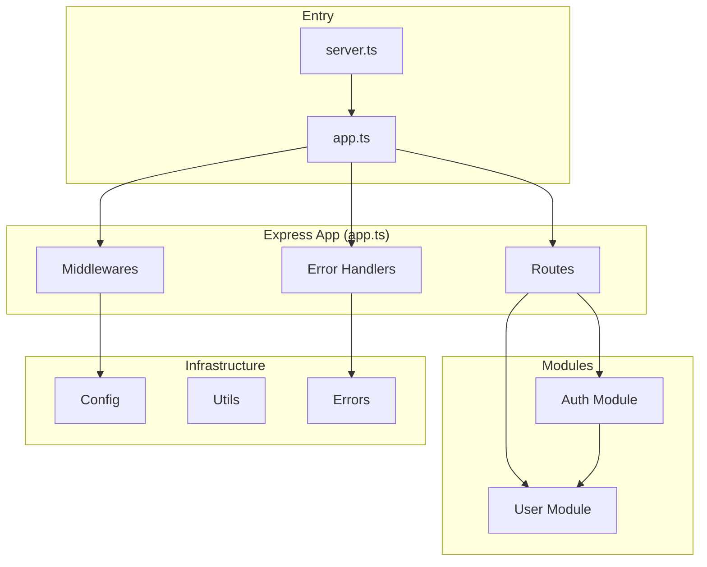
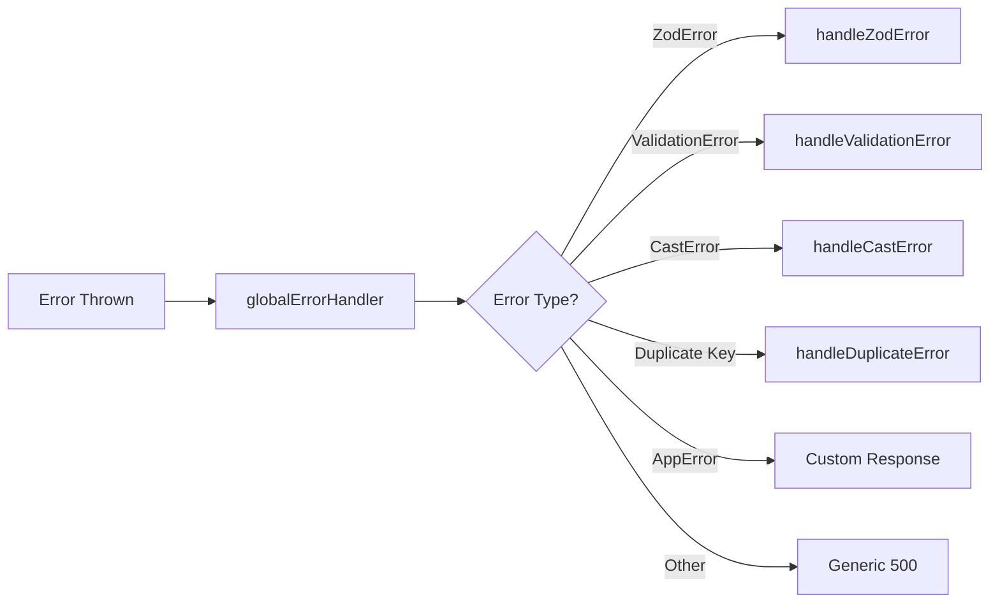

# HackDay Server - Codebase Walkthrough

A comprehensive Node.js/Express backend server with TypeScript, MongoDB, and JWT authentication.

## Architecture Overview



---

## Project Structure

| Directory | Purpose |
|-----------|---------|
| [src/](file:///media/nafiz/NewVolume/HackDay/Server/src) | Source code root |
| [src/app/modules/](file:///media/nafiz/NewVolume/HackDay/Server/src/app/modules) | Feature modules (Auth, User) |
| [src/app/middlewares/](file:///media/nafiz/NewVolume/HackDay/Server/src/app/middlewares) | Express middlewares |
| [src/app/errors/](file:///media/nafiz/NewVolume/HackDay/Server/src/app/errors) | Error handler utilities |
| [src/app/utils/](file:///media/nafiz/NewVolume/HackDay/Server/src/app/utils) | Helper functions |
| [src/app/config/](file:///media/nafiz/NewVolume/HackDay/Server/src/app/config) | Environment config |

---

## Entry Points

### [server.ts](file:///media/nafiz/NewVolume/HackDay/Server/src/server.ts)
The main entry point that:
- Connects to MongoDB using Mongoose
- Starts the Express server on the configured port

### [app.ts](file:///media/nafiz/NewVolume/HackDay/Server/src/app.ts)
Configures the Express application:
- **Parsers**: JSON body parser, cookie parser
- **CORS**: Allows `localhost:3000` and `localhost:3001`
- **Routes**: Mounts all API routes under `/api/v1`
- **Error Handling**: Global error handler and 404 handler

---

## Modules

### Auth Module

> [!IMPORTANT]
> This is the core authentication system with JWT-based access/refresh token strategy.

| File | Purpose |
|------|---------|
| [auth.route.ts](file:///media/nafiz/NewVolume/HackDay/Server/src/app/modules/Auth/auth.route.ts) | API endpoint definitions |
| [auth.controller.ts](file:///media/nafiz/NewVolume/HackDay/Server/src/app/modules/Auth/auth.controller.ts) | Request handlers |
| [auth.service.ts](file:///media/nafiz/NewVolume/HackDay/Server/src/app/modules/Auth/auth.service.ts) | Business logic |
| [auth.validation.ts](file:///media/nafiz/NewVolume/HackDay/Server/src/app/modules/Auth/auth.validation.ts) | Zod schemas |
| [auth.utils.ts](file:///media/nafiz/NewVolume/HackDay/Server/src/app/modules/Auth/auth.utils.ts) | JWT utilities |

**API Endpoints:**

```
POST /api/v1/auth/register      - Create new user account
POST /api/v1/auth/login         - Authenticate and get tokens
POST /api/v1/auth/change-password - Change password (auth required)
POST /api/v1/auth/refresh-token   - Refresh access token
```

**Key Features in `auth.service.ts`:**
- `registerUser()` - Checks for duplicates, creates user, returns tokens
- `loginUser()` - Validates credentials, returns access/refresh tokens
- `changePassword()` - Verifies old password, hashes and saves new one
- `refreshToken()` - Validates refresh token, issues new access token

---

### User Module

| File | Purpose |
|------|---------|
| [user.interface.ts](file:///media/nafiz/NewVolume/HackDay/Server/src/app/modules/User/user.interface.ts) | TypeScript type definitions |
| [user.model.ts](file:///media/nafiz/NewVolume/HackDay/Server/src/app/modules/User/user.model.ts) | Mongoose schema & model |

**User Schema Fields:**
- `name` - Required, trimmed string
- `email` - Required, unique, lowercase
- `password` - Required, excluded from queries by default (`select: false`)
- `role` - Enum: `'user'` or `'admin'` (default: `'user'`)
- `createdAt`, `updatedAt` - Auto-managed timestamps

**Schema Features:**
- **Pre-save Hook**: Automatically hashes password with bcrypt before saving
- **Instance Method**: `isPasswordMatched(plainPassword)` compares passwords

---

## Middlewares

| File | Purpose |
|------|---------|
| [auth.ts](file:///media/nafiz/NewVolume/HackDay/Server/src/app/middlewares/auth.ts) | JWT authentication & role authorization |
| [validateRequest.ts](file:///media/nafiz/NewVolume/HackDay/Server/src/app/middlewares/validateRequest.ts) | Zod schema validation |
| [globalErrorHandler.ts](file:///media/nafiz/NewVolume/HackDay/Server/src/app/middlewares/globalErrorHandler.ts) | Centralized error handling |
| [notFound.ts](file:///media/nafiz/NewVolume/HackDay/Server/src/app/middlewares/notFound.ts) | 404 handler |

**Auth Middleware (`auth.ts`):**
```typescript
auth('user', 'admin')  // Accepts roles as arguments
```
- Extracts token from `Authorization` header
- Verifies JWT signature
- Checks if user has required role
- Attaches decoded user to `req.user`

---

## Error Handling



| Handler | Triggers |
|---------|----------|
| `handleZodError` | Zod validation failures |
| `handleValidationError` | Mongoose validation errors |
| `handleCastError` | Invalid ObjectId format |
| `handleDuplicateError` | MongoDB code 11000 (unique constraint) |
| `AppError` | Custom application errors |

---

## Utilities

| File | Purpose |
|------|---------|
| [catchAsync.ts](file:///media/nafiz/NewVolume/HackDay/Server/src/app/utils/catchAsync.ts) | Wraps async handlers to forward errors |
| [sendResponse.ts](file:///media/nafiz/NewVolume/HackDay/Server/src/app/utils/sendResponse.ts) | Standardized API response format |
| [verifyJWT.ts](file:///media/nafiz/NewVolume/HackDay/Server/src/app/utils/verifyJWT.ts) | JWT verification helper |
| [emailSender.ts](file:///media/nafiz/NewVolume/HackDay/Server/src/app/utils/emailSender.ts) | Nodemailer email sending |
| [deleteImage.ts](file:///media/nafiz/NewVolume/HackDay/Server/src/app/utils/deleteImage.ts) | Cloudinary image deletion |

---

## Configuration

[config/index.ts](file:///media/nafiz/NewVolume/HackDay/Server/src/app/config/index.ts) exports environment variables:

| Variable | Purpose |
|----------|---------|
| `NODE_ENV` | Environment mode |
| `port` | Server port |
| `database_url` | MongoDB connection string |
| `bcrypt_salt_rounds` | Password hashing rounds |
| `jwt_access_secret` | Access token signing key |
| `jwt_refresh_secret` | Refresh token signing key |
| `jwt_access_expires_in` | Access token expiry |
| `jwt_refresh_expires_in` | Refresh token expiry |
| `cloudinary_*` | Cloudinary credentials |
| `sender_email/sender_app_pass` | Email credentials |

---

## Technology Stack

| Category | Technology |
|----------|------------|
| Runtime | Node.js 18+ |
| Framework | Express.js |
| Language | TypeScript |
| Database | MongoDB + Mongoose |
| Authentication | JWT (jsonwebtoken) |
| Password Hashing | bcryptjs |
| Validation | Zod |
| File Upload | Multer + Cloudinary |
| Email | Nodemailer |

---

## Security Features

> [!TIP]
> The server implements several security best practices:

1. **Password Security**
   - Bcrypt hashing with configurable salt rounds
   - Passwords excluded from queries by default

2. **Token Strategy**
   - Separate access/refresh tokens
   - HttpOnly cookies for refresh tokens
   - Configurable token expiration

3. **Role-Based Access**
   - Middleware enforces role requirements
   - Supports multiple roles per route

4. **Input Validation**
   - Zod schemas validate all request data
   - Mongoose validation as secondary layer
